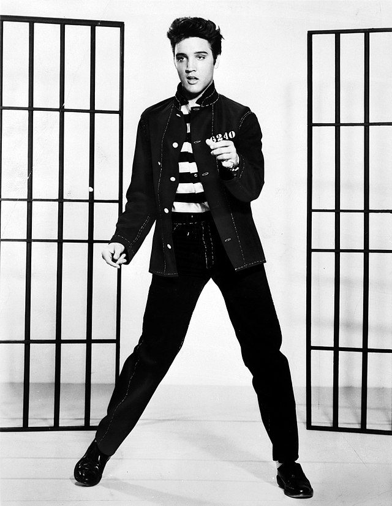

```{r setup, include=FALSE}
knitr::opts_chunk$set(echo = TRUE)
remotes::install_github('jaburgoyne/compmus')
library(spotifyr)
library(tidyverse)
library(ggplot2)
library(extrafont)
library(plotly)
library(compmus)

pl_elvis <- get_playlist_audio_features("", "37i9dQZF1DZ06evO2n9pny?si=145a97dc92974834")
pl_bbking <- get_playlist_audio_features("", "37i9dQZF1DXbahoSMxtpoF?si=0f1553f2bfc24734")

pl_both <- rbind(pl_elvis, pl_bbking) %>%
  select("playlist_name", "energy", "acousticness", "liveness", "valence", "loudness", "danceability", "track.name")

scatterplot <- ggplot(pl_both, aes(x = energy, y = acousticness, size = valence, color = playlist_name, text = paste("Trackname:", track.name))) +
  geom_point(alpha=0.8) +
  facet_wrap(~playlist_name)

pl_average <- aggregate(cbind(acousticness, valence, liveness, danceability, energy) ~ playlist_name, data = pl_both, FUN = mean, na.rm=TRUE)

pl_average <- pl_average %>% 
  gather(key = score, value = Value, acousticness:energy)

simple_statistics <- ggplot(pl_average, aes(score, y = Value, fill = playlist_name)) +
  geom_col(position = "dodge") +
  ylim(0,1)+
  labs(x = "Feature", y = "Average of playlist") 
```
{.tabset}
---------------------------

### Chordogram
```{r echo = FALSE}
circshift <- function(v, n) {
  if (n == 0) v else c(tail(v, n), head(v, -n))
}

#      C     C#    D     Eb    E     F     F#    G     Ab    A     Bb    B
major_chord <-
  c(   1,    0,    0,    0,    1,    0,    0,    1,    0,    0,    0,    0)
minor_chord <-
  c(   1,    0,    0,    1,    0,    0,    0,    1,    0,    0,    0,    0)
seventh_chord <-
  c(   1,    0,    0,    0,    1,    0,    0,    1,    0,    0,    1,    0)

major_key <-
  c(6.35, 2.23, 3.48, 2.33, 4.38, 4.09, 2.52, 5.19, 2.39, 3.66, 2.29, 2.88)
minor_key <-
  c(6.33, 2.68, 3.52, 5.38, 2.60, 3.53, 2.54, 4.75, 3.98, 2.69, 3.34, 3.17)

chord_templates <-
  tribble(
    ~name, ~template,
    "Gb:7", circshift(seventh_chord, 6),
    "Gb:maj", circshift(major_chord, 6),
    "Bb:min", circshift(minor_chord, 10),
    "Db:maj", circshift(major_chord, 1),
    "F:min", circshift(minor_chord, 5),
    "Ab:7", circshift(seventh_chord, 8),
    "Ab:maj", circshift(major_chord, 8),
    "C:min", circshift(minor_chord, 0),
    "Eb:7", circshift(seventh_chord, 3),
    "Eb:maj", circshift(major_chord, 3),
    "G:min", circshift(minor_chord, 7),
    "Bb:7", circshift(seventh_chord, 10),
    "Bb:maj", circshift(major_chord, 10),
    "D:min", circshift(minor_chord, 2),
    "F:7", circshift(seventh_chord, 5),
    "F:maj", circshift(major_chord, 5),
    "A:min", circshift(minor_chord, 9),
    "C:7", circshift(seventh_chord, 0),
    "C:maj", circshift(major_chord, 0),
    "E:min", circshift(minor_chord, 4),
    "G:7", circshift(seventh_chord, 7),
    "G:maj", circshift(major_chord, 7),
    "B:min", circshift(minor_chord, 11),
    "D:7", circshift(seventh_chord, 2),
    "D:maj", circshift(major_chord, 2),
    "F#:min", circshift(minor_chord, 6),
    "A:7", circshift(seventh_chord, 9),
    "A:maj", circshift(major_chord, 9),
    "C#:min", circshift(minor_chord, 1),
    "E:7", circshift(seventh_chord, 4),
    "E:maj", circshift(major_chord, 4),
    "G#:min", circshift(minor_chord, 8),
    "B:7", circshift(seventh_chord, 11),
    "B:maj", circshift(major_chord, 11),
    "D#:min", circshift(minor_chord, 3)
  )

key_templates <-
  tribble(
    ~name, ~template,
    "Gb:maj", circshift(major_key, 6),
    "Bb:min", circshift(minor_key, 10),
    "Db:maj", circshift(major_key, 1),
    "F:min", circshift(minor_key, 5),
    "Ab:maj", circshift(major_key, 8),
    "C:min", circshift(minor_key, 0),
    "Eb:maj", circshift(major_key, 3),
    "G:min", circshift(minor_key, 7),
    "Bb:maj", circshift(major_key, 10),
    "D:min", circshift(minor_key, 2),
    "F:maj", circshift(major_key, 5),
    "A:min", circshift(minor_key, 9),
    "C:maj", circshift(major_key, 0),
    "E:min", circshift(minor_key, 4),
    "G:maj", circshift(major_key, 7),
    "B:min", circshift(minor_key, 11),
    "D:maj", circshift(major_key, 2),
    "F#:min", circshift(minor_key, 6),
    "A:maj", circshift(major_key, 9),
    "C#:min", circshift(minor_key, 1),
    "E:maj", circshift(major_key, 4),
    "G#:min", circshift(minor_key, 8),
    "B:maj", circshift(major_key, 11),
    "D#:min", circshift(minor_key, 3)
  )

thrill_is_gone <-
  get_tidy_audio_analysis("3cg0dJfrQB66Qf2YthPb6G?si=dd239ceea721404c") |>
  compmus_align(sections, segments) |>
  select(sections) |>
  unnest(sections) |>
  mutate(
    pitches =
      map(segments,
          compmus_summarise, pitches,
          method = "mean", norm = "manhattan"
      )
  )

keygram_thrill_is_gone <- thrill_is_gone |> 
  compmus_match_pitch_template(
    key_templates,         # Change to chord_templates if descired
    method = "euclidean",  # Try different distance metrics
    norm = "manhattan"     # Try different norms
  ) |>
  ggplot(
    aes(x = start + duration / 2, width = duration, y = name, fill = d)
  ) +
  geom_tile() +
  scale_fill_viridis_c(guide = "none") +
  theme_minimal() +
  labs(x = "Time (s)", y = "") +
  ggtitle("Keygram of 'Thrill is gone'")

chordgram_thrill_is_gone <- thrill_is_gone |> 
  compmus_match_pitch_template(
    chord_templates,         # Change to chord_templates if descired
    method = "euclidean",  # Try different distance metrics
    norm = "manhattan"     # Try different norms
  ) |>
  ggplot(
    aes(x = start + duration / 2, width = duration, y = name, fill = d)
  ) +
  geom_tile() +
  scale_fill_viridis_c(guide = "none") +
  theme_minimal() +
  labs(x = "Time (s)", y = "") +
  ggtitle("Chordogram of 'Thrill is gone'")

chordgram_thrill_is_gone
```

***
Chrodogram of 'The thrill is gone'.

'The thrill is gone' by B.B. King has four verses, from which three of the verses are the same. There is an intro and a very long outro on the guitar, and between verse two and three there is a bridge. 

### Keygram

```{r echo=FALSE}
keygram_thrill_is_gone
```

***
'The thrill is gone' by B.B. King has four verses, from which three of the verses are the same. There is an intro and a very long outro on the guitar, and between verse two and three there is a bridge. 

Keygram of one of 'The thrill is gone' by B.B. King. The song holds almost the whole song the same key. Right before we hit the 200 seconds, we see a little remarkable line in the keygram. This is the fourth verse of the song, and just like our keygram is showing, this verse is more different from the other verses.

### Standard deviation

```{r echo=FALSE}
elvis_genre <-
  get_playlist_audio_features(
    "thesoundsofspotify",
    "37i9dQZF1DZ06evO2n9pny?si=145a97dc92974834"
  ) |>
  slice(1:30) |>
  add_audio_analysis()
king_genre <-
  get_playlist_audio_features(
    "thesoundsofspotify",
    "37i9dQZF1DXbahoSMxtpoF?si=0f1553f2bfc24734"
  ) |>
  slice(1:30) |>
  add_audio_analysis()
blues_rock <-
  elvis_genre |>
  mutate(genre = "Elvis") |>
  bind_rows(king_genre |> mutate(genre = "B.B. King"))

blues_rock |>
  mutate(
    sections =
      map(
        sections,                                    # sections or segments
        summarise_at,
        vars(tempo, loudness, duration),             # features of interest
        list(section_mean = mean, section_sd = sd)   # aggregation functions
      )
  ) |>
  unnest(sections) |>
  ggplot(
    aes(
      x = tempo,
      y = tempo_section_sd,
      colour = genre,
      alpha = loudness
    )
  ) +
  geom_point(aes(size = duration / 60)) +
  geom_rug() +
  theme_minimal() +
  ylim(0, 5) +
  labs(
    x = "Mean Tempo (bpm)",
    y = "SD Tempo",
    colour = "Genre",
    size = "Duration (min)",
    alpha = "Volume (dBFS)"
  ) +
  ggtitle("Track-level summary of B.B. King vs. Elvis Presley")
```


### Introduction
In this project we are going to compare two very influential music artists and their genres.

In this project I'm going to compare the King of Rock and Roll (Elvis Presley) against the King of Blues (B.B. King). These two music artists are very influential in their genres. I have combined two playlists as a corpus: [This is Elvis Presley](https://open.spotify.com/playlist/37i9dQZF1DZ06evO2n9pny?si=c5af214d20ab41f0) and [This is B.B. King](https://open.spotify.com/playlist/37i9dQZF1DXbahoSMxtpoF?si=2fa45d75884048b2). The 'This is Elvis Presley' playlist consists of 51 songs. The 'This is B.B. King' playlist consists of 25 songs. The tracks are really representative for the artists, since they are specially made to represent the artists. 

Since Rock and Roll originated from several genres, among them the Blues, I expect that there is an overlap between those genres.

***
{width=100%}

{width=100%}

### First impression of the playlists
```{r echo=FALSE}
ggplotly(scatterplot)
```

*** 
This two scatterplots gives a simple overview of the distribution of the songs. The B.B. King playlist consists of 25 songs. The Elvis Presley plalist consists of 51 songs. 

The size of the points are the valence of the song. There are a lot of songs in the Elvis Presley playlists that are in the top left corner (low energy and a high acousticness). 

### Average scores comparisons

```{r echo=FALSE}
ggplotly(simple_statistics)
```

***
What do we see in the statistics plot? For the valence, danceability and energy B.B. King scores a bit higher then Elvis. Elvis Presley scores higher on acousticness and a bit higher on liveness. 

Is this something one would think? Blues is known to be more acoustic then rock and roll. So it seems a bit strange that the average acousticness of the playlist 'This is Elvis Presley' scores a lot higher. I would also say that it is remarkable that the energy score of B.B. King is higher then Elvis Presley.

### Chromagram

```{r echo=FALSE}
# Jailhouse rock chromagram
jailhouse_rock <-
  get_tidy_audio_analysis("452KBpASS5lZLeJWX9Ixub?si=a5d64e8413854dea") |>
  select(segments) |>
  unnest(segments) |>
  select(start, duration, pitches, timbre)
jailhouse_rock |>
  mutate(pitches = map(pitches, compmus_normalise, "euclidean")) |>
  compmus_gather_chroma() |> 
  ggplot(
    aes(
      x = start + duration / 2,
      width = duration,
      y = pitch_class,
      fill = value
    )
  ) +
  geom_tile() +
  ggtitle("Chromagram of Jailhouse Rock") +
  labs(x = "Time (s)", y = NULL, fill = "Magnitude") +
  theme_minimal() +
  scale_fill_viridis_c()
```

***

### Self-similarity matrices Jailhouse Rock

```{r echo=FALSE}
jailhouse_rock |>
  compmus_self_similarity(pitches, "cosine") |> 
  ggplot(
    aes(
      x = xstart + xduration / 2,
      width = xduration,
      y = ystart + yduration / 2,
      height = yduration,
      fill = d
    )
  ) +
  geom_tile() +
  coord_fixed() +
  scale_fill_viridis_c() +
  theme_classic() +
  ggtitle("Self-similarity matrix based on pitch of Jailhouse Rock") +
  labs(x = "time (s) ", y = "time (s)") 

jailhouse_rock |>
  compmus_self_similarity(timbre, "cosine") |> 
  ggplot(
    aes(
      x = xstart + xduration / 2,
      width = xduration,
      y = ystart + yduration / 2,
      height = yduration,
      fill = d
    )
  ) +
  geom_tile() +
  coord_fixed() +
  scale_fill_viridis_c() +
  theme_classic() +
  labs(x = "", y = "") +
  ggtitle("Self-similarity matrix based on timbre of Jailhouse Rock")
```

***
On the left we see self-similarity matrices based on pitch and timbre of Jailhouse Rock. For everyone who knows this number, the number is quite repetitive and that is exactly what we can see in the matrices. There are a lot of diagonals and at 60s we can see that there is something else happening. There is a instrumental moment in the middle of the song. 

### Self-similarity matrix The Thrill is gone
```{r echo=FALSE}
thrill_is_gone <-
  get_tidy_audio_analysis("3cg0dJfrQB66Qf2YthPb6G?si=b629a9347001477c") |>
  select(segments) |>
  unnest(segments) |>
  select(start, duration, pitches, timbre)

thrill_is_gone |>
  compmus_self_similarity(pitches, "cosine") |> 
  ggplot(
    aes(
      x = xstart + xduration / 2,
      width = xduration,
      y = ystart + yduration / 2,
      height = yduration,
      fill = d
    )
  ) +
  geom_tile() +
  coord_fixed() +
  scale_fill_viridis_c() +
  theme_classic() +
  labs(x = "time (s) ", y = "time (s)") 
```

***
On the left we see a self-similarity matrix based on pitch of 'The thrill is gone'. We see that there is a lot of diagonal lines, because of the repetition. The diagonals disappear in the last minute. 