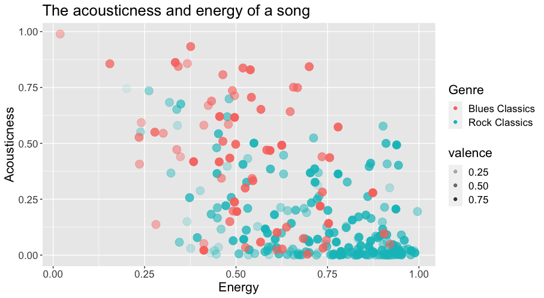

```{r setup, include=FALSE}
knitr::opts_chunk$set(echo = TRUE)
```
Introduction
==============
Column A
-----------------------
### Homework week 6: Introduction


What is the influence of 'blues' in rock music? Blues has an influence on rock music, but can we still hear those characteristics in the rock music? Elvis Presley, king of rock, covered a lot of music genres, among them the blues. Can we still find characteristics of blues in modern day Rock music? What do those genres have in common?

Many artists who are succesfull in the rock music, are also known for their blues music. We can think about Eric Clapton, B.B. King and Elvis Presley. I do think aspects of blues are also captured in the rock music. Since it are two different genres, there must be a lot of differences between those genres. I'm curious to research what they have in common and where they differ.

As Spotify has classified numbers for all genres, I have chosen two playlists made by Spotify: Rock classics and Blues classics. I hope that therefore the playlists are composed in the same way. However, I do not know how they build those playlists. The Rock classics consists of 202 songs and the Blues classics of 70 songs. This is a major difference, and I suppose that this would be a limitation of the corpus.

Identify several tracks in your corpus that are either extremely typical or atypical. Why do you think that they are so typical or so strange? Several pages of your final portfolio will be dedicated to detailed analyses of specific tracks, and so it is important to think about which ones might be most interesting. Although it is not required at this stage, you may want to try using Github Markdown Links to an external site.mark-up to format your text.

I do not know if there are any songs atypical, since that is one of the things I want to sort out. Solsbury Hill from Peter Gabriel is however a song that is quite slow and is written in 7/4 time, which is unusual for Rock music. I would classify 'Gimme shelter' from the Rolling stones as a typical rock song. It has the usual time signature 4/4 and there is an electric guitar involved.

Column B
-------------------
The playlists used for this project:

[Blues classics](https://open.spotify.com/playlist/37i9dQZF1DXd9rSDyQguIk?si=618ca90308354bbc)

[Rock classics](https://open.spotify.com/playlist/37i9dQZF1DWXRqgorJj26U?si=a3aa8ce598534ec4> )

Visualisations
===========
Column A
-------------------
### Homework week 7: GGPlot


 
This plot shows two variables that are quite different for blues and rock. The blues classics score in general more for acousticness, while the rock classics have a higher score in energy overall. The valence is expressed in the alpha. The lighter the shade of the point, the less valence a song has.

Column B
------------------

Discussion & Conclusion
===========

More information
===========
## Variables

"Acousticness" is one of the audio features that Spotify uses to describe a song's sound characteristics. It measures the degree to which a song sounds like it was recorded using only acoustic instruments or with electronic instruments that simulate an acoustic sound.

The acousticness value is measured on a scale from 0.0 to 1.0, with 1.0 indicating a high level of acousticness and 0.0 indicating a low level. A song with a high acousticness value will typically have a more organic, natural sound, with the presence of acoustic guitars, pianos, or other acoustic instruments being more prominent in the mix. A song with a low acousticness value will usually have a more synthetic or electronic sound, with the presence of electronic instruments being more prominent in the mix.
